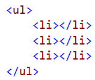
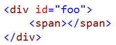
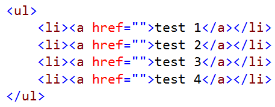
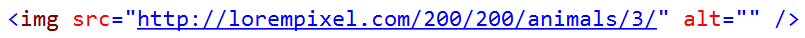
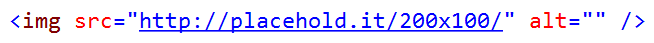

# ZenCoding

<!-- Update the VS Gallery link after you upload the VSIX-->
Download this extension from the [VS Gallery](https://visualstudiogallery.msdn.microsoft.com/[GuidFromGallery])
or get the [CI build](http://vsixgallery.com/extension/9514d70e-a7b1-4876-847d-b0d2ad0962bf/).

---------------------------------------

Provides ZenCoding for the HTML Editor - full support for static HTML, Razor and WebForms.

See the [change log](CHANGELOG.md) for changes and road map.

## Features

- HTML ZenCoding
- Lorem Ipsum generator
- Lorem Pixel image generator
- PlaceHold.it image generator

### HTML ZenCoding
ZenCoding is a quick way to generate HTML markup by using a CSS based syntax.

To invoke ZenCoding, write the syntax and hit the `TAB` key to generate the markup.

#### Examples:

Syntax __ul>li\*3__ generates:

Syntax __#foo>span__ generates:

Syntax __ul>li\*4>a{test $}__ generates:

### Lorem Ipsum generator
As part of ZenCoding, you can now generate Lorem Ipsum code directly in the HTML editor. Simply type `lorem` and hit `TAB` and a 30 word Lorem Ipsum text is inserted. 

Type `lorem10` and a 10 word Lorem Ipsum text is inserted. 
This can be used in conjuction with ZenCoding like so: `ul>li\*5>lorem3`

### Lorem Pixel generator
As part of ZenCoding, you can also generate Lorem Pixel code directly in the HTML editor. Simply type `pix-200x200-animals` and hit `TAB` and a img tag with a 200x200 image of an animal is inserted:

### PlaceHold.it generator
ZenCoding also support [PlaceHold.it](http://placehold.it/) if you prefer blank images. Type `place-50` and hit `TAB` to have a 50 pixels square image. Use `place-200x100` to insert a rectangular image:

You can choose the background color by adding the hexadecimal value after the size like this `place-150x240-EEEDDD`. You can even add text to the image by using `place-150x240-EEE-t=This%20is%20some%20text`.

## Contribute
Check out the [contribution guidelines](.github/CONTRIBUTING.md)
if you want to contribute to this project.

For cloning and building this project yourself, make sure
to install the
[Extensibility Tools 2015](https://visualstudiogallery.msdn.microsoft.com/ab39a092-1343-46e2-b0f1-6a3f91155aa6)
extension for Visual Studio which enables some features
used by this project.

## License
[Apache 2.0](LICENSE)